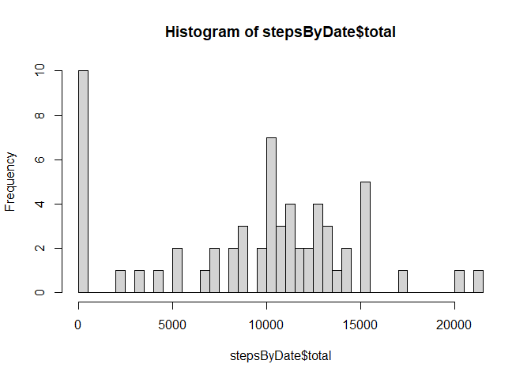
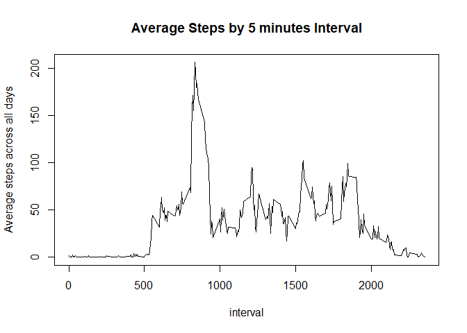
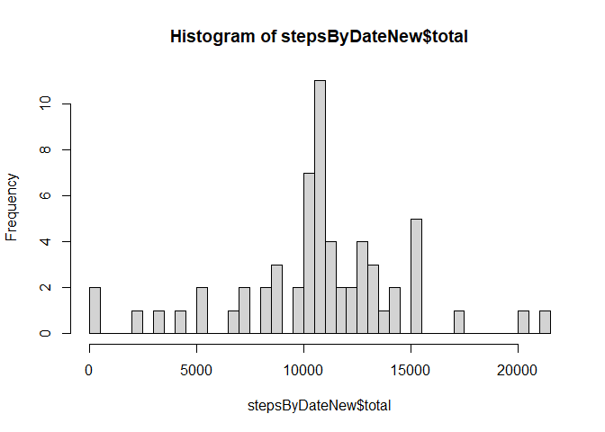
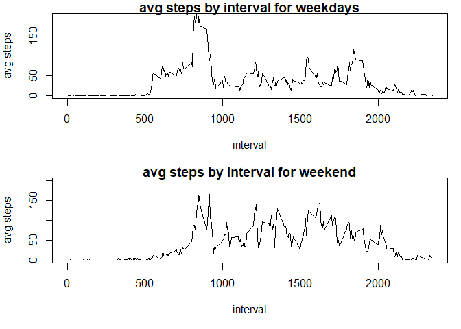

## Loading and preprocessing the data

The dataset activity is downloaded from https://d396qusza40orc.cloudfront.net/repdata%2Fdata%2Factivity.zip


```r
activity<-read.csv(file="C:/Users/William/Documents/Rproject/RepData_PeerAssessment1/activity.csv",header=TRUE,sep=",",
                   stringsAsFactors = FALSE)
str(activity)
```

```
## 'data.frame':	17568 obs. of  3 variables:
##  $ steps   : int  NA NA NA NA NA NA NA NA NA NA ...
##  $ date    : chr  "2012-10-01" "2012-10-01" "2012-10-01" "2012-10-01" ...
##  $ interval: int  0 5 10 15 20 25 30 35 40 45 ...
```

```r
#unique(activity$date)
```

## What is mean total number of steps taken per day?

For this part of the assignment, you can ignore the missing values in the dataset.

1. Make a histogram of the total number of steps taken each day

2.Calculate and report the mean and median total number of steps taken per day


```r
library(dplyr)
```

```
## 
## Attaching package: 'dplyr'
```

```
## The following objects are masked from 'package:stats':
## 
##     filter, lag
```

```
## The following objects are masked from 'package:base':
## 
##     intersect, setdiff, setequal, union
```

```r
stepsByDate<-activity%>%group_by(date)%>%summarise(total=sum(steps,na.rm=TRUE))
```

```
## `summarise()` ungrouping output (override with `.groups` argument)
```

```r
head(stepsByDate)
```

```
## # A tibble: 6 x 2
##   date       total
##   <chr>      <int>
## 1 2012-10-01     0
## 2 2012-10-02   126
## 3 2012-10-03 11352
## 4 2012-10-04 12116
## 5 2012-10-05 13294
## 6 2012-10-06 15420
```

```r
dim(stepsByDate)
```

```
## [1] 61  2
```

```r
hist(stepsByDate$total,breaks=40)
```

<!-- -->

```r
data.frame(mean=mean(stepsByDate$total),median=median(stepsByDate$total))
```

```
##      mean median
## 1 9354.23  10395
```

##What is the average daily activity pattern?
1. Make a time series plot (i.e. type = "l") of the 5-minute interval (x-axis) and the average number of steps taken, averaged across all days (y-axis)

2.Which 5-minute interval, on average across all the days in the dataset, contains the maximum number of steps?


```r
stepsByInterval<-activity%>%group_by(interval)%>%summarise(avg=mean(steps,na.rm=TRUE))
```

```
## `summarise()` ungrouping output (override with `.groups` argument)
```

```r
head(stepsByInterval)
```

```
## # A tibble: 6 x 2
##   interval    avg
##      <int>  <dbl>
## 1        0 1.72  
## 2        5 0.340 
## 3       10 0.132 
## 4       15 0.151 
## 5       20 0.0755
## 6       25 2.09
```

```r
dim(stepsByInterval)
```

```
## [1] 288   2
```

```r
with(stepsByInterval,plot(interval,avg,type="l",main="Average Steps by 5 minutes Interval",
                          ylab="Average steps across all days"))
```

<!-- -->

```r
maxSteps<-max(stepsByInterval$avg)
maxInterval<-stepsByInterval[stepsByInterval$avg == maxSteps,]$interval
data.frame(maxSteps=maxSteps,maxInterval=maxInterval)
```

```
##   maxSteps maxInterval
## 1 206.1698         835
```

##Imputing missing values
Note that there are a number of days/intervals where there are missing values (coded as NA). The presence of missing days may introduce bias into some calculations or summaries of the data.

1. Calculate and report the total number of missing values in the dataset (i.e. the total number of rows with NAs)

2. Devise a strategy for filling in all of the missing values in the dataset. The strategy does not need to be sophisticated. For example, you could use the mean/median for that day, or the mean for that 5-minute interval, etc.

3. Create a new dataset that is equal to the original dataset but with the missing data filled in.

 *activityNew is the new dataset with missing value filled in*

4. Make a histogram of the total number of steps taken each day and Calculate and report the mean and median total number of steps taken per day. Do these values differ from the estimates from the first part of the assignment? What is the impact of imputing missing data on the estimates of the total daily number of steps? 

 *yes, the values differ from the first part of the assignment*  
 
 *the values are higher with imputing missing data than the first part of the assignment*


```r
data.frame(totalNumberOfNAs=sum(is.na(activity$steps)))
```

```
##   totalNumberOfNAs
## 1             2304
```

```r
activityNew<-activity %>% 
  group_by(interval) %>% 
  mutate(steps = ifelse(is.na(steps), mean(steps, na.rm = T), steps))
stepsByDateNew<-activityNew%>%group_by(date)%>%summarise(total=sum(steps,na.rm=TRUE))
```

```
## `summarise()` ungrouping output (override with `.groups` argument)
```

```r
head(stepsByDateNew)
```

```
## # A tibble: 6 x 2
##   date        total
##   <chr>       <dbl>
## 1 2012-10-01 10766.
## 2 2012-10-02   126 
## 3 2012-10-03 11352 
## 4 2012-10-04 12116 
## 5 2012-10-05 13294 
## 6 2012-10-06 15420
```

```r
dim(stepsByDateNew)
```

```
## [1] 61  2
```

```r
hist(stepsByDateNew$total,breaks=40)
```

<!-- -->

```r
data.frame(mean=mean(stepsByDateNew$total),median=median(stepsByDateNew$total))
```

```
##       mean   median
## 1 10766.19 10766.19
```
##Are there differences in activity patterns between weekdays and weekends?
For this part the weekdays() function may be of some help here. Use the dataset with the filled-in missing values for this part.

1. Create a new factor variable in the dataset with two levels -- "weekday" and "weekend" indicating whether a given date is a weekday or weekend day.

2. Make a panel plot containing a time series plot (i.e. type = "l") of the 5-minute interval (x-axis) and the average number of steps taken, averaged across all weekday days or weekend days (y-axis). The plot should look something like the following, which was created using simulated data:
 
 *yes there are differences in activity patterns between weekdays and weekends by looking at the plots*  
 

```r
activityNewNew<-mutate(activityNew, days=ifelse(weekdays(as.Date(date)) %in% c('Saturday','Sunday'),
                                                'weekend','weekday'))
head(activityNewNew)
```

```
## # A tibble: 6 x 4
## # Groups:   interval [6]
##    steps date       interval days   
##    <dbl> <chr>         <int> <chr>  
## 1 1.72   2012-10-01        0 weekday
## 2 0.340  2012-10-01        5 weekday
## 3 0.132  2012-10-01       10 weekday
## 4 0.151  2012-10-01       15 weekday
## 5 0.0755 2012-10-01       20 weekday
## 6 2.09   2012-10-01       25 weekday
```

```r
activityWeekdays<-activityNewNew[activityNewNew$days=='weekday',]
weekdaysAvg<-activityWeekdays%>%group_by(interval)%>%summarise(avg=mean(steps))
```

```
## `summarise()` ungrouping output (override with `.groups` argument)
```

```r
activityWeekend<-activityNewNew[activityNewNew$days=='weekend',]
weekendAvg<-activityWeekend%>%group_by(interval)%>%summarise(avg=mean(steps))
```

```
## `summarise()` ungrouping output (override with `.groups` argument)
```

```r
par(mfrow=c(2,1),mar=c(5,4,1,1))
with(weekdaysAvg,plot(interval,avg,type="l",main= "avg steps by interval for weekdays",ylab="avg steps",ylim=c(0,200)))
with(weekendAvg,plot(interval,avg,type="l",main= "avg steps by interval for weekend",ylab="avg steps",ylim=c(0,200)))
```

<!-- -->

